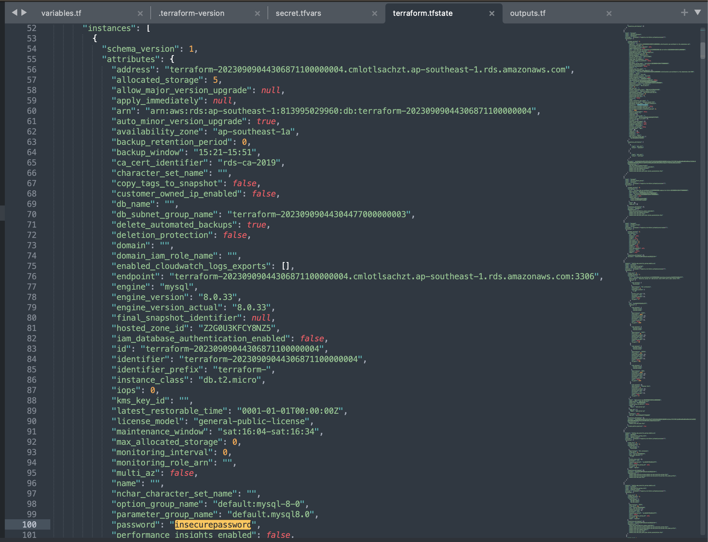
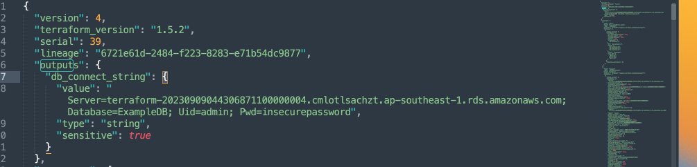

# Learn Terraform sensitive input variables

This repo is a companion repo to the [Learn Terraform sensitive input variables](https://developer.hashicorp.com/terraform/tutorials/configuration-language/sensitive-variables) tutorial.
It contains Terraform configuration you can use to learn how Terraform sensitive input variables help you manage sensitive information.

# State file will contains sensitive data in the outputs and resources attribute

* In the Resource Attributes

* In the outputs 

